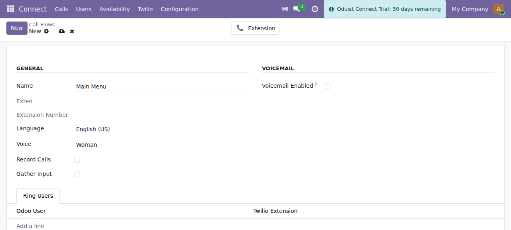
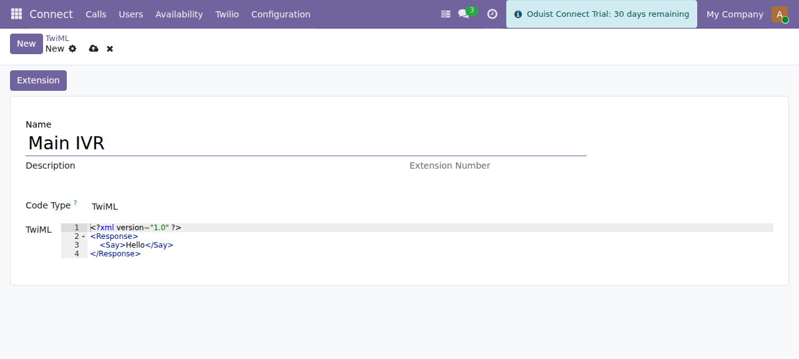

# Call Flows & TwiML Apps

Twilio call handling in Connect comes in two layers: **Call Flows** (managed IVR
menus rendered as TwiML `<Gather>`) and **TwiML Apps** (arbitrary voice logic).

## Call Flows (IVR)

Manage under **Connect ▸ Twilio ▸ Call Flows** (`connect.twilio.callflow`).

A call flow plays a prompt and gathers a caller response (DTMF and/or speech),
then routes to an extension based on the choice.

*A call flow: prompt language and voice, gather/record toggles, ring users and an
optional voicemail fallback.*

| Field | Description |
|-------|-------------|
| **Name** | Call-flow label. |
| **Extension** | Auto-created `connect.twilio.exten` that points at this flow. |
| **Language** | BCP-47 language for the `<Say>` prompt (e.g. `en-US`). |
| **Voice** | Twilio voice used to read the prompt. |
| **Gather config** | Input type (DTMF/speech), number of digits, timeout, etc. |
| **Choices** | One row per menu option: **digits**, target **extension**, optional **speech** hint. |
| **Ring Users** | Users to ring for a "reception"-style flow. |
| **Voicemail** | Optional voicemail fallback. |

### How it runs

1. The flow renders a TwiML `<Gather>` wrapping a `<Say>` prompt. The gather's
   action URL points at `/twilio/webhook/callflow/<id>/gather`.
2. Twilio collects the caller's DTMF/speech and POSTs it back.
3. `gather_action()` matches the input against the configured **choices** and
   routes the call to the corresponding extension.

!!! note "Language list is duplicated by design"
    The BCP-47 language selection is intentionally copied across the Twilio,
    FreeSWITCH and Telnyx call flows and core `connect.user` (ADR-031/ADR-037).
    There is no shared mixin — a change to the list must be applied to every copy
    in the same commit.

## TwiML Applications

Manage under **Connect ▸ Twilio ▸ TwiML Apps** (`connect.twilio.twiml`). A TwiML
app is a reusable voice application you can attach to a number, an extension, a
SIP domain, or a user.

| Code Type | Field | Description |
|-----------|-------|-------------|
| **TwiML** | `twiml` | Raw TwiML XML, rendered as a Jinja2 template. |
| **TwiPy** | `twipy` | Python code that programmatically builds and returns TwiML. |
| **Model Method** | `model` + `method` | Calls a named method on an Odoo model to produce TwiML. |

*A TwiML application. The code type selects raw TwiML, TwiPy (Python) or a model
method.*

Other fields: **Name**, **Description**, computed **Voice URL / Voice Fallback
URL / Voice Status URL**, **SID** (Twilio Application SID), and an associated
**Extension**.

### Lifecycle

- Creating a TwiML app creates the corresponding Twilio Application via the API
  and an extension for direct dialing.
- Editing pushes updated webhook URLs to Twilio.
- Deleting removes the Twilio Application.
- Inbound voice requests hit `/twilio/webhook/twiml/<id>`, which calls
  `render()` and dispatches to the twiml / twipy / model-method renderer.

!!! warning "TwiPy runs server-side Python"
    The **TwiPy** code type executes Python (`exec`) to generate TwiML. Only
    Connect Administrators can edit TwiML apps (`connect.group_admin` has full
    CRUD; the Connect User group has read-only access). Treat TwiPy code as
    trusted server code and review it accordingly.

## Default TwiML data

The module ships default TwiML in `data/twiml.xml`. The `voice_call_request`
WhatsApp content template (in `data/whatsapp_templates.xml`) is used for voice
call consent requests.
