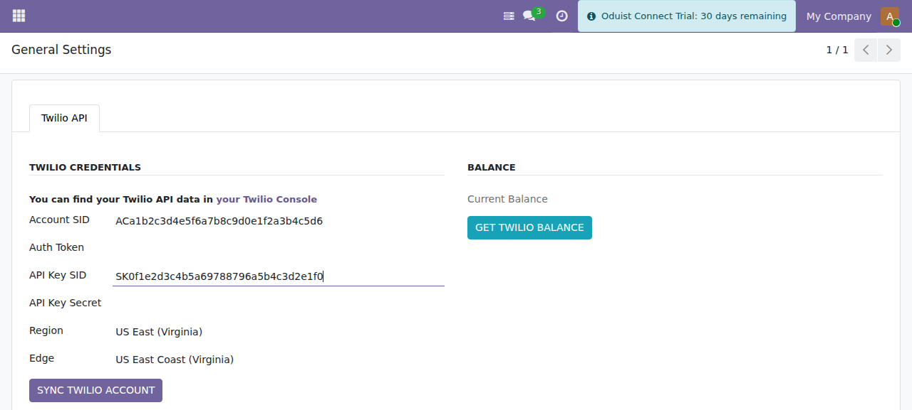

# Account Configuration

Open **Connect ▸ Twilio ▸ Configuration ▸ Settings** (Connect Administrator
only). This standalone form edits the shared `connect.settings` singleton but
exposes **only** the Twilio fields.

*The Twilio Settings form — credentials, region/edge, account sync and balance.*

!!! note "Set the public API URL first"
    Twilio settings live on the shared `connect.settings` record, which also
    holds the core **API URL**. Set it (in **Connect ▸ Configuration ▸
    Settings**) to your public HTTPS Odoo URL, e.g. `https://odoo.example.com`,
    before syncing — the sync validates the API URL and every webhook URL Connect
    pushes to Twilio is built from it.

## Credentials

Find these in the [Twilio Console](https://console.twilio.com/):

- **Account SID** and **Auth Token** are shown on the Console **dashboard** (home page).
- **API Key SID** and **API Key Secret** are created under **Account → API keys & tokens** (Console **Settings → API keys & auth tokens**). The secret is displayed only once, at creation.

| Field | Description |
|-------|-------------|
| **Account SID** | Twilio Account SID (starts with `AC`). |
| **Auth Token** | Twilio Auth Token. Stored on the `auth_token` field, restricted to the ERP-manager group, shown masked (`****`) to everyone else, and used for webhook signature validation. |
| **API Key SID** | Twilio API Key (starts with `SK`). Required to mint Voice SDK tokens for the web phone. |
| **API Key Secret** | Twilio API Key secret. Restricted and masked like the Auth Token. |

!!! warning "Protected fields"
    `auth_token` and `twilio_api_secret` are never exposed to the
    `connect.group_webhook` identity used by public webhook controllers. The
    display fields (`display_auth_token`, `display_twilio_api_secret`) are
    overwritten with `*` on save; the real values are stored on the underlying
    fields via `sudo()`.

## Region and Edge

| Field | Options | Description |
|-------|---------|-------------|
| **Region** | US East (`us1`), Ireland (`ie1`), Australia (`au1`) | Twilio data-center region. |
| **Edge** | ashburn, umatilla, dublin, frankfurt, sydney, sao-paulo, tokyo, singapore | Nearest Twilio edge for lower media latency. |

Changing the **Region** automatically resets the **Edge** to a sensible default
(`us1 → ashburn`, `ie1 → dublin`, `au1 → sydney`). You can then override it.

## Options

| Field | Default | Description |
|-------|---------|-------------|
| **Auto Sync** | On | Push changes to Twilio automatically when Connect records change. Shown only in developer mode. |
| **Fetch Call Prices** | Off | After each call completes, fetch its cost from the Twilio API (populated by a scheduled job — see [Maintenance](maintenance.md#scheduled-jobs)). |
| **Verify Twilio Requests** | On | Validate the `X-Twilio-Signature` header on every incoming webhook. Found under the **Development** tab (developer mode). Keep it **on** in production. |

## Syncing the Twilio account

Click **SYNC TWILIO ACCOUNT** to import all Twilio resources into Connect. The
sync requires the Account SID and Auth Token to be set and the API URL to be
valid, then imports, in order:

1. TwiML applications (`connect.twilio.twiml`)
2. SIP domains (`connect.twilio.domain`)
3. Phone numbers (`connect.twilio.number`)
4. Outgoing caller IDs (`connect.twilio.outgoing_callerid`)
5. WhatsApp senders (`connect.whatsapp_sender`)
6. WhatsApp content templates (`connect.message_content_template`)

If the credentials are wrong, the sync raises *"Error authenticating requests to
the Twilio API! Check your Auth Key!"* (Twilio error `20003`).

Each resource list also has its own **Sync** action, so you can refresh a single
category (e.g. only numbers) without a full account sync.

## Account balance

Click **GET TWILIO BALANCE** to fetch and display the current account balance.
Some account types/regions do not expose the balance endpoint; in that case
Connect shows *"Balance API not available for this account"* instead of failing.
