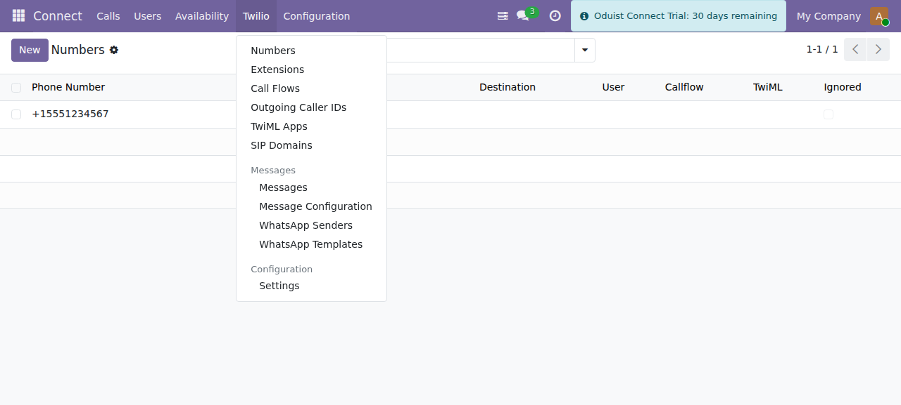

# Oduist Connect Twilio — Administrator Guide

`connect_twilio` integrates [Twilio](https://www.twilio.com) with the Oduist
Connect telephony platform for Odoo. It adds the Twilio REST API client, webhook
handlers, TwiML generation, SIP domain management, a browser web phone built on
the Twilio Voice JavaScript SDK, and SMS/WhatsApp messaging.

The module extends the shared Connect ledger (`connect.call`, `connect.channel`,
`connect.message`, `connect.recording`, `connect.user`, `connect.settings`) and
**owns its own PBX-configuration models** under the `connect.twilio.*` namespace
(numbers, extensions, call flows, caller IDs, TwiML apps, SIP domains). It never
imports code from other provider modules, so it can be co-installed alongside
FreeSWITCH, Telnyx, Asterisk and the other Connect providers.

## What this module provides

| Area | Capability |
|------|------------|
| **Voice** | Inbound routing (user / call flow / TwiML), outbound click-to-call via the Twilio API, call transfer, call recording, voicemail |
| **Web phone** | In-browser softphone (Twilio Voice SDK), incoming/outgoing calls, hold, mute, DTMF, runtime recording control |
| **SIP** | SIP domains and per-user SIP credentials for hardware/software SIP phones |
| **IVR** | Call flows with `<Gather>` DTMF/speech menus and TwiML applications (raw TwiML, Python, or model method) |
| **Messaging** | SMS and WhatsApp send/receive, WhatsApp senders and pre-approved content templates |
| **Billing** | Optional per-call price fetching from the Twilio API, account balance display |

## Prerequisites

- A running Odoo instance with the core `connect` module installed.
- The `twilio` Python package available in the Odoo environment
  (`external_dependencies.python = ['twilio']`).
- A Twilio account with an Account SID, Auth Token, API Key/Secret and at least
  one phone number.
- **A publicly reachable HTTPS URL for Odoo.** Twilio delivers all events over
  webhooks and requires HTTPS for signature validation.

## Guide contents

1. [Installation](installation.md) — installing the module and its dependency.
2. [Account Configuration](configuration.md) — credentials, region/edge, sync,
   balance, options.
3. [Users, SIP & Web Phone](users-and-sip.md) — per-user telephony setup and SIP
   domains.
4. [Numbers & Call Routing](numbers-and-routing.md) — inbound numbers, extensions,
   outgoing caller IDs.
5. [Call Flows & TwiML Apps](call-flows-twiml.md) — IVR menus and custom voice
   applications.
6. [Messaging (SMS & WhatsApp)](messaging.md) — senders, templates, composers.
7. [Webhooks & Security](webhooks-security.md) — routes, signature validation,
   access groups.
8. [Maintenance](maintenance.md) — scheduled jobs, licensing, troubleshooting.

## Menu location

Everything lives under the **Connect ▸ Twilio** submenu of the Connect app.

*The Twilio submenu: Numbers, Extensions, Call Flows, Outgoing Caller IDs, TwiML
Apps, SIP Domains, Messages and Configuration.*

!!! info "Administrator-only screens"
    Administrative screens (Configuration, WhatsApp senders/templates, message
    configuration) require the **Connect Administrator** group
    (`connect.group_admin`).
