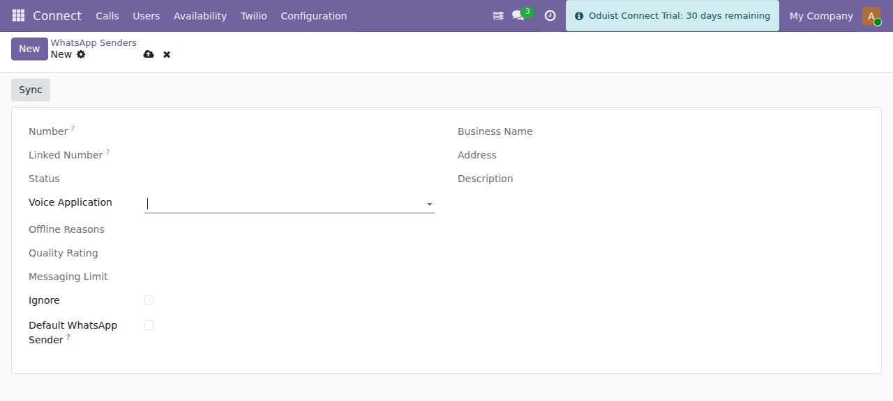

# Messaging (SMS & WhatsApp)

Twilio provides the SMS and WhatsApp implementation of the core
`connect.message` ledger. When a user's **message provider** is `twilio`,
`connect.message.send()` dispatches to the Twilio API; otherwise it falls through
to another installed messaging provider.

Messaging screens live under **Connect ▸ Twilio ▸ Messages**.

## Sending SMS

Use the **SMS composer** (`sms.composer`, shipped by this module since ADR-031).
It lists the available outgoing numbers and sends through
`connect.message.send()` (the Twilio implementation). Incoming SMS arrive on the
`/twilio/webhook/message` route and are turned into `connect.message` records by
`receive()`; delivery-status callbacks arrive on `/twilio/webhook/message_status`.

## WhatsApp

### WhatsApp senders

Manage under **Connect ▸ Twilio ▸ Messages ▸ WhatsApp Senders**
(`connect.whatsapp_sender`, admin-only). Click **Sync** to import senders from
your Twilio account.

*A WhatsApp sender — number, status, business profile and the default-sender flag.*

| Field | Description |
|-------|-------------|
| **Number** | WhatsApp phone number. |
| **Status** | Online / offline (with offline reasons). |
| **Default** | Default sender for users without a personal sender. |
| **Profile** | Business profile: name, about, address, description, emails, logo, websites. |
| **Quality Rating** | Twilio quality rating. |
| **Messaging Limit** | Daily message limit tier. |
| **Voice Application** | TwiML app used for WhatsApp voice calls. |
| **Callback URLs** | Computed inbound + status callback URLs. |

Assign a sender to a user via the **WhatsApp Sender** field on the user form
(see [Users, SIP & Web Phone](users-and-sip.md)).

### WhatsApp content templates

Manage under **Connect ▸ Twilio ▸ Messages ▸ WhatsApp Templates**
(`connect.message_content_template`, admin-only). WhatsApp requires templates to
be approved before they can be used for outbound (business-initiated) messaging.
Use **Sync** to import them from Twilio.

| Field | Description |
|-------|-------------|
| **Name** | Template name. |
| **Category** | Utility, Authentication, or Marketing. |
| **Language** | Template language. |
| **Content Type** | Text, media, list-picker, card, carousel, etc. |
| **Variables** | Placeholder variables (`{{1}}`, `{{2}}`, …). |
| **Approval Status** | Unsubmitted, pending, approved, rejected, paused, disabled. |

### Sending WhatsApp messages

The **WhatsApp composer** (`connect.whatsapp_composer`) sends a message through
`whatsapp_sender.send_whatsapp()`. Pick a **sender**, a **partner / phone
number**, optionally a **template**, and a **body**. Sent and received messages
are posted to the partner's chatter and stored in the `connect.message` ledger.

### WhatsApp voice calls

A WhatsApp sender with a **Voice Application** also carries WhatsApp calling.
Users place one with the **WhatsApp Call** action next to any phone number
(see [Making and Receiving Calls](../Core/user/calls.md)).

How the call is placed:

1. Connect rings the user's own web phone over ordinary voice. This leg
   presents a **normal voice caller ID**, never the `whatsapp:` identity — with
   a `whatsapp:` `From` Twilio accepts the request, reports `From=None` and
   ends the call in the same second, so the WhatsApp leg never runs.
2. The TwiML that leg executes carries the WhatsApp identity on
   `<Dial callerId="whatsapp:…"><WhatsApp>`, which places the leg to the
   destination.

Both legs land in the ledger and the call is recorded with call type
**WhatsApp**.

!!! warning "Business-initiated calling is restricted by country"
    WhatsApp does not allow business-initiated calls to every destination. Where
    it is not permitted Twilio rejects the WhatsApp leg with error **37007**
    (*"WhatsApp Voice: Business-initiated calling is not available in the
    country"*), visible on the call record's **Error** tab. Inbound WhatsApp
    calls from those countries still work.

## Message configuration (inbound routing)

Manage under **Connect ▸ Twilio ▸ Messages ▸ Message Configuration**
(`connect.twilio.message_configuration`, admin-only). It routes incoming messages
on a given Twilio number to a destination (e.g. create/lookup a `res.partner`),
with optional JSON `default_values` for the created record.

!!! info "CRM routing"
    Routing incoming messages to CRM leads is handled by the auto-installed
    bridge module `connect_crm_twilio` (installed when both `connect_crm` and
    `connect_twilio` are present).
