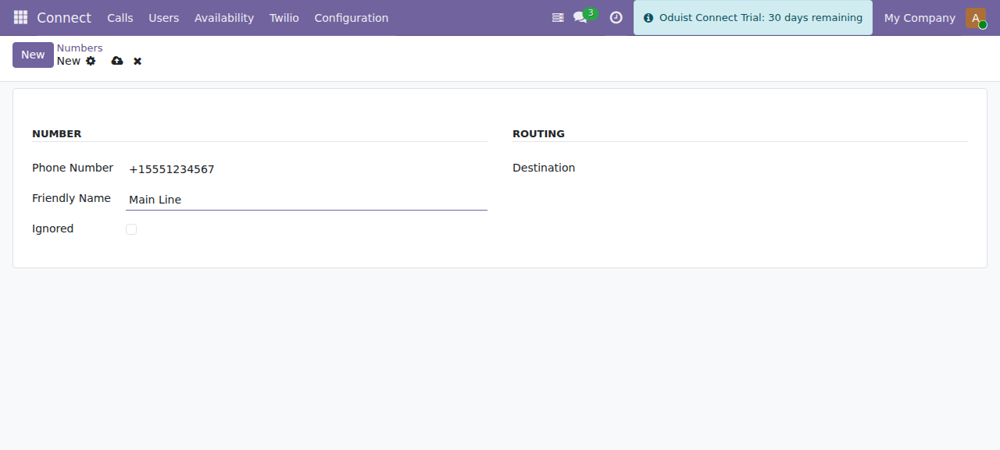
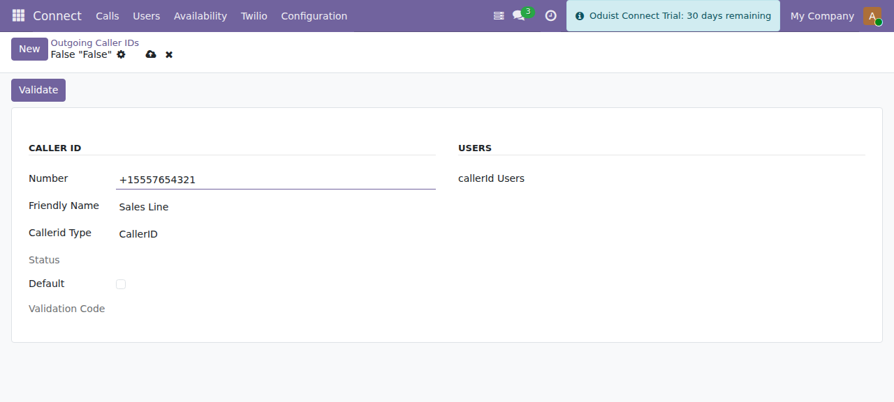

# Numbers & Call Routing

## Phone numbers

Manage inbound DIDs under **Connect ▸ Twilio ▸ Numbers**
(`connect.twilio.number`).

| Field | Description |
|-------|-------------|
| **Phone Number** | The DID in E.164, unique. |
| **Friendly Name** | Label from Twilio. |
| **SID** | Twilio Phone Number SID (populated by sync). |
| **Destination** | Where inbound calls to this number go: **User**, **Call Flow**, or **TwiML**. |
| **User / Call Flow / TwiML** | The target record for the chosen destination. |
| **Ignore** | Skip this number during sync. |
| **Voice / Message URLs** | Computed webhook URLs pushed to Twilio. |

*A Twilio number — set **Destination** to User, Call Flow or TwiML to route
inbound calls.*

When you set (or change) the destination and save, Connect pushes the matching
voice and messaging webhook URLs to Twilio automatically, so the number starts
routing through Odoo. An inbound call hits
`/twilio/webhook/number`, which calls `route_call()` and returns the TwiML for
the configured destination.

Use **Sync** on the number list to import numbers from the Twilio account.

## Extensions

Manage internal extension routing under **Connect ▸ Twilio ▸ Extensions**
(`connect.twilio.exten`).

- **Number** — the extension digits (up to 4), unique within Twilio.
- **Destination** — a polymorphic reference to a **User**, a **Call Flow**
  (`connect.twilio.callflow`), or a **TwiML app** (`connect.twilio.twiml`).
- A **TwiML preview** shows what the extension renders.

Extension uniqueness is **per provider** — a Twilio extension `100` is
completely independent of a FreeSWITCH extension `100`. Users, call flows and
TwiML apps each get an extension automatically when created.

## Outgoing caller IDs

Manage the numbers your users present on outbound external calls under
**Connect ▸ Twilio ▸ Outgoing Caller IDs** (`connect.twilio.outgoing_callerid`).

| Field | Description |
|-------|-------------|
| **Friendly Name** | Label. |
| **Number** | E.164, unique, **must start with `+`**. |
| **Default** | Exactly one caller ID may be the default; used for users without a personal caller ID. |
| **SID** | Twilio OutgoingCallerID SID. |
| **Users** | Users assigned this caller ID. |

*Adding an outgoing caller ID. Only one caller ID can be the default.*

### Validating a caller ID

Twilio requires ownership verification for numbers you do not own on Twilio:

1. Create the caller ID — creation kicks off Twilio validation and returns a
   **validation code**.
2. Twilio calls the number; the callee enters the code.
3. Twilio posts the result to `/twilio/webhook/outgoing_callerid`, which updates
   the record status.

Deleting a caller ID removes it from Twilio; renaming updates its friendly name
on Twilio.

## Outbound call routing (summary)

When a user places a click-to-call (and their `originate_provider` is `twilio`):

1. The number is normalized; anything longer than 4 digits is treated as
   external and prefixed with `+`.
2. The user's first call-flow leg (`client` or `sip`) determines whether the
   call is delivered to the browser (`client:`) or to a SIP endpoint.
3. If the dialed number matches an internal extension, that extension's TwiML is
   used; otherwise an external `<Dial>` TwiML is built with the user's (or the
   default) outgoing caller ID.
4. A recording status callback is attached when the user has call recording
   enabled, and a `connect.channel` row is created to track the leg.

WhatsApp voice calls follow the same path but dial through the user's WhatsApp
sender number instead of a PSTN caller ID.
