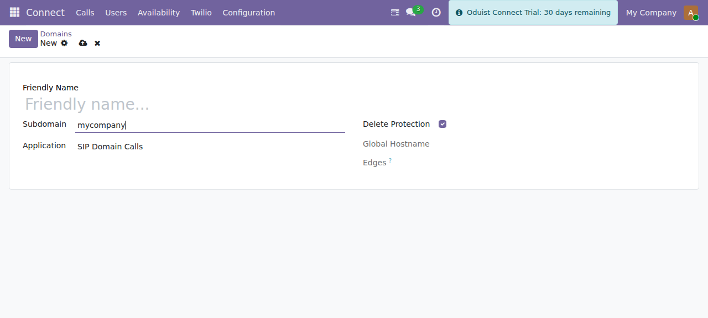
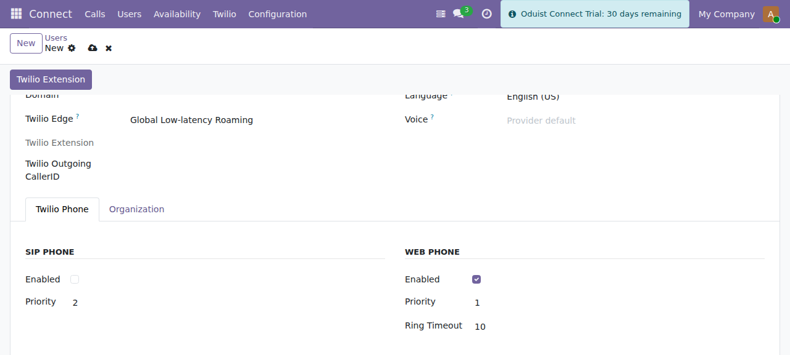

# Users, SIP & Web Phone

Twilio adds a **Twilio phone** section to each PBX user (**Connect ▸ Users**) and
introduces SIP domains that host the user credentials.

## SIP Domains

Manage domains under **Connect ▸ Twilio ▸ SIP Domains**. A SIP domain is required
for SIP phone registration; the web phone works through the Twilio Voice SDK and
does not strictly need a SIP domain, but a domain is the standard place to hold
per-user credentials.

| Field | Description |
|-------|-------------|
| **Subdomain** | Custom subdomain — `mycompany` becomes `mycompany.sip.twilio.com`. |
| **Friendly name** | Human-readable label. |
| **Application** | TwiML app that handles voice for the domain; auto-created if left empty. |
| **SIP Registration** | Allow SIP phones to register against the domain. |
| **Delete Protection** | Guard against accidental deletion. |
| **Edge domains** | Computed edge-specific SIP hostnames. |

*Creating a SIP domain — Connect provisions the Twilio domain, a credential list
and per-user credentials automatically.*

When you create a domain, Connect automatically:

1. Creates the SIP domain on Twilio.
2. Creates a credential list.
3. Adds SIP credentials for every existing PBX user.

Existing Twilio domains and their credentials can be imported by name during
sync rather than recreated.

## Per-user telephony setup

Editing a PBX user, the Twilio integration adds these fields.

*The **Twilio Phone** tab on a PBX user: SIP phone and web phone (Twilio Client),
each with its own enable switch, ring priority and timeout.*

### Extension

Give every PBX user an extension: open the user and press **Extension**, then
enter the number (100, 101, ...). Nothing assigns one automatically.

The extension is what colleagues dial to reach the user, and it is the caller
ID the user's own calls present — the number that shows on the callee's phone
and in the call history. A user without one falls back to their own outgoing
caller ID, then the default outgoing caller ID, and only then to their client
identity (ADR-058).

### Web phone (Twilio Client)

| Field | Description |
|-------|-------------|
| **Web Phone Enabled** (`client_enabled`) | Allow this user to make/receive calls in the browser. Default: **on only when Twilio is the sole telephony module installed**; enable per user in multi-provider databases. |
| **Web Phone Priority** (`client_priority`) | Ring order across channels: `1` = first, `2` = second. |
| **Web Phone Ring Timeout** (`client_ring_timeout`) | Seconds to ring before falling through to the next channel. |
| **Edge** (`twilio_edge`) | Preferred Twilio edge for this user's web phone. |

### SIP phone

| Field | Description |
|-------|-------------|
| **SIP Phone Enabled** (`sip_enabled`) | Allow this user to register a hardware/software SIP phone. |
| **SIP Priority** (`sip_priority`) | Ring order (`1`/`2`). |
| **SIP Ring Timeout** (`sip_ring_timeout`) | Seconds to ring the SIP phone. |

### SIP credentials

| Field | Description |
|-------|-------------|
| **Username** | Alphanumeric PBX username, **unique**. Required only when the SIP phone or web phone is enabled — a user with no Twilio phone may leave it empty (relevant when several providers are co-installed). |
| **Domain** | SIP domain for this user (`connect.twilio.domain`). Same conditional requirement as Username. |
| **Password** | SIP password. Auto-generated with a strong policy (12+ characters). |
| **SIP URI** | Computed `username@domain.sip.twilio.com`. |

!!! info "Automatic credential management"
    Creating a user (or enabling a Twilio phone on one) automatically creates the
    matching SIP credential and extension on Twilio. Changing the password
    updates it on Twilio; deleting the user removes the credential. Existing
    Twilio credentials are imported rather than duplicated.

### Other per-user fields

| Field | Description |
|-------|-------------|
| **TwiML Application** (`application`) | Override the domain-level TwiML app for this specific user. |
| **Outgoing Caller ID** (`twilio_outgoing_callerid`) | The caller ID this user presents on outbound external calls; falls back to the global default caller ID. |
| **WhatsApp Sender** (`whatsapp_sender_id`) | WhatsApp number assigned to this user. |
| **Extension** (`twilio_exten`) | The user's internal extension (auto-created). |

## Web phone token

The browser softphone requests a JWT from `connect.user.get_client_token()`,
which is signed with the **API Key SID / Secret** from settings. If web-phone
users cannot register, verify those two credentials are set and correct.
